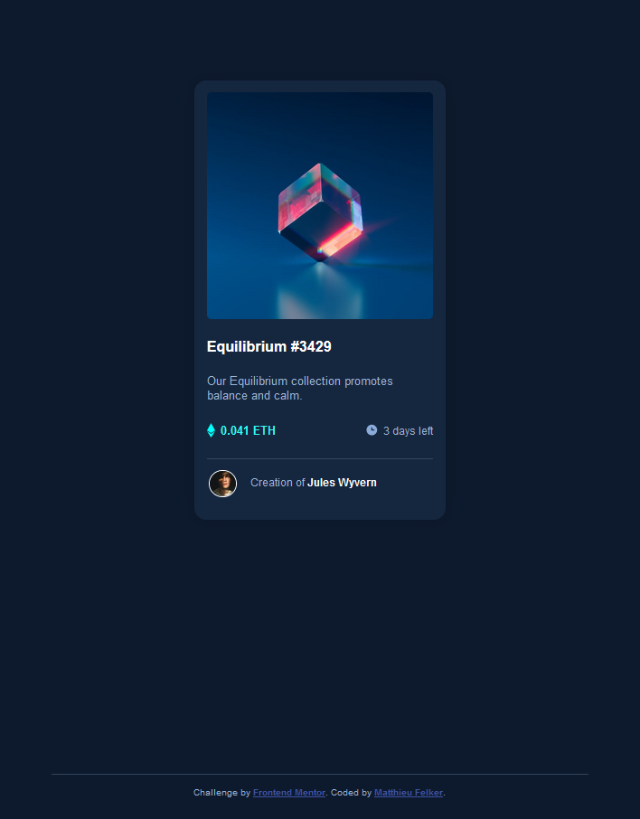

# Frontend Mentor - NFT preview card component solution

This is a solution to the [NFT preview card component challenge on Frontend Mentor](https://www.frontendmentor.io/challenges/nft-preview-card-component-SbdUL_w0U). Frontend Mentor challenges help you improve your coding skills by building realistic projects. 

## Table of contents

- [Overview](#overview)
  - [The challenge](#the-challenge)
  - [Screenshot](#screenshot)
  - [Links](#links)
- [My process](#my-process)
  - [Built with](#built-with)
- [Author](#author)

## Overview

### The challenge

Users should be able to:

- View the optimal layout depending on their device's screen size
- See hover states for interactive elements

### Screenshot

### Links

- Solution URL: [solution URL here](https://www.frontendmentor.io/solutions/html-skeleton-css-3oizp4Q5k)
- Live Site URL: [Chttps://matthieufelker.io/nft-card/](https://matthieufelker.io/nft-card/)

## My process

- This design utilized a very light and simple and responisive css boilerplate --[http://getskeleton.com/
](Skeleton). I started by making a few required changes in the default skeloton stylesheet for matching the color palet, active states, etc. I set a new container, then after adding in the supplied content, it was just a matter of creating classes for that content and styling them appropiatly to best match the example desktop design. 
### Built with

- Semantic HTML5 markup
- CSS custom properties - [Skeloton](getskeloton.com)
- Mobile-first workflow

## Author

- Website - [Add your name here](https://matthieufelker.io)
- Frontend Mentor - [@yourusername](https://www.frontendmentor.io/profile/Matthieu-ui)
- Twitter - [@fattmelker](https://www.twitter.com/fattmelker)
- GitHub - [Matthieu-ui](https://github.com/matthieu-ui)
